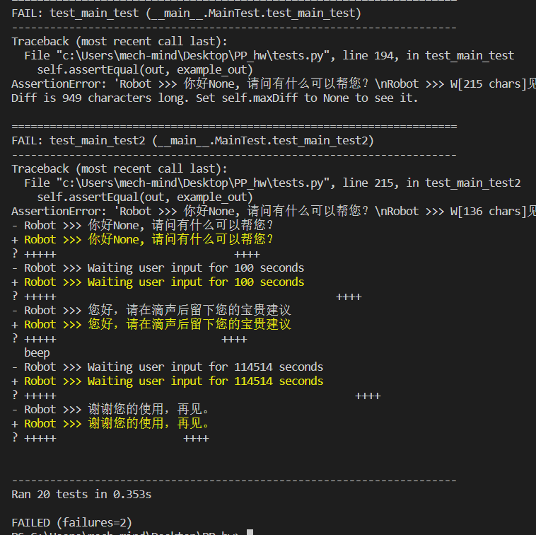

#                                 程序设计实践实验报告

##                                                   班级:2021211308

##                                                        姓名:吴显科

##                                                    学号:2021211391


## DSL语言设计

1. ### 注释（Comment）

    以 `#` 开始的行表示注释，用于提供代码的解释和说明。注释不会被解释执行，仅用于文档目的。

2. ### 步骤（Step）

    以 `step` 关键字开始的部分表示一个执行步骤或阶段。每个步骤包含一系列指令，用于定义在该步骤中要执行的操作。例如，`step Main` 表示一个名为 "Main" 的步骤。

3. ### 指令（Instruction）

    在每个步骤内部，可以包含多个指令，用于执行具体的操作。以下是一些常见的指令类型：

    -   `callpy`：调用一个 Python 函数，并传递参数。
    -   赋值语句：将值赋给一个变量，如 `$name = $_ret`。
    -   `speak`：用于输出文本。
    -   `wait`：等待一段时间。
    -   `switch` 和 `case`：用于条件分支和执行不同的操作，根据输入关键字或条件。
    -   `beep`：发出滴声。
    -   `hangup`：挂断电话连接。

4. ### 变量（Variable）

    以 `$` 开头的名称表示变量，用于存储和传递值。例如，`$name` 和 `$balance` 是变量。

5. 参数（Argument）

    在指令中可以传递参数，如 `$_number` 和 `$_input_keyword`。这些参数可以是输入数据、函数的返回值或其他信息。


## 应答机器人的模块设计

1.   ### ConfigLoader

     #### 主要功能: 

     加载配置文件，验证配置的完整性，处理缺省值，并提供方法来获取不同部分的配置信息

     #### 函数说明：

     1.  `__init__` 方法：初始化 `ConfigLoader` 类的实例。它可以接受一个可选的参数 `path`，如果提供了路径，它将尝试加载配置文件。在构造函数中，它还会调用 `load` 方法来加载配置文件。
     2.  `getConfig` 方法：返回配置文件解析出的对象。这个对象包含了从配置文件中读取的各种配置信息。
     3.  `load` 方法：加载配置文件，进行完整性检查，并处理缺省值。它接受两个可选参数：`path`（配置文件的路径，默认为"./config.yaml"）和 `encoding`（默认为"utf8"）。它使用 `yaml` 模块的 `load` 函数来解析配置文件，并通过 `_validate` 方法进行验证。如果验证通过，配置信息将存储在 `_config` 中，否则将创建一个空字典。
     4.  `getRuntimeConfig` 方法：返回配置中 "runtime" 部分的配置信息。
     5.  `getJobConfig` 方法：返回配置中 "job" 部分的配置信息。
     6.  `getScriptsConfig` 方法：返回配置中 "scripts" 部分的配置信息。
     7.  `_updateDefault` 方法：从默认配置文件中加载默认值，并将其与从配置文件加载的值合并。默认配置文件路径为 "./src/data/default_config.yaml"。这样做可以确保配置文件中未定义的配置项使用默认值。
     8.  `_validate` 方法：使用 `schema` 模块的 `Schema` 类定义了一个配置的模式。这个模式定义了配置中各个键的名称、类型和默认值。`_validate` 方法将配置文件与这个模式进行验证，以确保配置的完整性和正确性。

2.   ### Interpreter

     #### 主要功能：

     将脚本解释和执行，它可以执行不同类型的操作，包括调用 Python 函数、赋值、输出文本、等待、分支判断等。它还能够解析配置文件和脚本文件，提供运行时的支持，以实现脚本的灵活和可控的执行。

     #### 函数说明：

     1.  `__init__` 方法：初始化 `Interpreter` 类的实例。它接受一个 `configLoader` 参数，用于加载配置信息和初始化其他组件。在构造函数中，它完成了以下任务：
         -   创建一个 `Lexer` 对象和一个 `Parser` 对象，用于分词和解析脚本。
         -   使用传入的 `configLoader` 初始化运行时配置。
         -   加载并解析脚本文件，生成抽象语法树（AST）。
         -   初始化其他属性，如 `runtime`、`job`、`ast` 和 `steps`。
     2.  `accept` 方法：接受一个 `Runtime` 对象作为参数，并开始从 "Main" 步骤运行脚本。这个方法用于执行脚本。
     3.  `run` 方法：开始运行脚本。它首先检查是否设置了运行时和是否已经解析了脚本。然后它从 "Main" 步骤开始执行脚本。
     4.  `stop` 方法：用于停止脚本的执行。它设置一个内部标志 `_stop`，在脚本的执行过程中可以检查这个标志来终止脚本的执行。
     5.  `_getStep` 方法：根据步骤名称获取对应的 AST 节点（步骤定义）。
     6.  `_runStep` 方法：执行一个步骤，包括执行该步骤中的各种表达式。
     7.  `_exec` 方法：执行一个表达式，根据表达式类型执行不同的操作，如调用函数、赋值、输出文本等。
     8.  `_callpy` 方法：调用 Python 函数，并传递参数。它使用 `RunPy` 模块中的 `callFunc` 方法来执行 Python 函数。
     9.  `_exec_switch` 方法：执行 switch 语句，根据条件选择执行不同的分支。
     10.  `_eval` 方法：用于求解一个表达式，返回表达式的值。它可以处理变量、字符串、多个子节点的拼接以及可变参数等情况。
     11.  `_setargs` 方法：将参数传递给运行时，以供后续使用。
     12.  `_load_job` 方法：加载脚本文件，并将其内容存储在 `self.job` 中。
     13.  `_parse` 方法：解析脚本文件，生成抽象语法树（AST）。AST 表示了脚本的结构和逻辑。

3.   ### RunPy

     #### 主要功能：

     管理脚本函数的注册和执行，它可以加载脚本文件、注册脚本函数、调用脚本函数，并根据配置信息决定如何处理脚本执行过程中的异常。

     #### 函数说明：

     1.  `getInstance` 函数：获取全局的 `RunPy` 实例，使用了单例模式，确保在整个应用程序中只有一个 `RunPy` 实例。
     2.  `__init__` 方法：初始化 `RunPy` 类的实例。它初始化了一些属性，如 `_configLoader`（用于加载配置信息）、`_fileList`（用于存储脚本文件的列表）和 `_nameFuncMap`（用于存储脚本函数名称和对应的 Python 函数的映射）。
     3.  `init` 方法：用于初始化全局 `RunPy` 实例。它接受一个 `configLoader` 参数，用于加载配置信息。在初始化过程中，它完成了以下任务：
         -   获取配置中指定的脚本目录列表。
         -   遍历脚本目录列表，获取所有以 `.py` 结尾的脚本文件。
         -   使用 `importlib.util` 模块加载并执行脚本文件，将其导入到运行环境中。
     4.  `register` 方法：为全局 `RunPy` 实例注册脚本函数的装饰器。它接受一个脚本函数的名称作为参数，并返回一个装饰器函数，用于注册脚本函数。注册的脚本函数将存储在 `_nameFuncMap` 中。
     5.  `callFunc` 方法：调用已注册的脚本函数。它接受一个脚本函数的名称和参数列表作为参数。在调用前，它会检查脚本函数是否已注册，以及传入参数的数量是否符合脚本函数的要求。如果脚本函数执行过程中出现异常，根据配置信息决定是否抛出异常或忽略异常。
     6.  `_getConfig` 方法：用于获取配置信息，包括脚本配置中的信息，例如是否启用错误中断（`halt-onerror`）等。
     7.  `_getFiles` 方法：用于获取指定目录下的所有以 `.py` 结尾的脚本文件，并将它们添加到 `_fileList` 列表中。
     8.  `runpy` 对象：全局的 `RunPy` 实例，使用单例模式确保唯一性。

4.   ### Runtime

     #### 主要功能：

     用于管理和执行脚本的运行时环境，包含了一些用于与用户交互、处理变量和执行命令的方法。

     #### 函数说明：

     1.  `__init__` 方法：初始化 `Runtime` 类的实例。它接受三个参数：`number`（用户号码）、`config`（配置加载器对象）和 `enable_timeout`（是否启用超时处理）。在初始化过程中，它完成了以下任务：
         -   存储配置加载器对象和是否启用超时处理的信息。
         -   初始化 `_variables` 字典，用于存储变量的值，包括 `_input`（用户输入的字符串）、`_input_keyword`（从用户输入中提取的关键词）、`_number`（用户号码）和 `_ret`（脚本返回值）。
     2.  `speak` 方法：用于输出文本消息。它将消息以黄色文本打印到控制台，并显示 "Robot >>>" 作为前缀。
     3.  `wait` 方法：等待用户输入，并处理超时情况。它接受一个 `timeStr` 参数，表示等待的时间（秒）。根据是否启用超时处理，它会等待用户输入，如果超过指定时间则超时。用户输入的内容会存储在 `_input` 变量中，并使用 `_extractKeywords` 和 `_extractNumbers` 方法提取关键词和数字。
     4.  `hangup` 方法：用于挂断连接，终止脚本的执行。它会记录用户号码并输出日志信息。
     5.  `assign` 方法：为变量赋值。它接受一个变量名 `var` 和一个值 `val` 作为参数，将值转换为字符串后赋给变量。
     6.  `beep` 方法：用于实现发送滴声的方法，为电话客服设计。它简单地输出 "beep" 到控制台。
     7.  `getvar` 方法：用于获取变量的值。它接受一个变量名 `varname` 作为参数，并返回该变量的值。如果变量不存在，则返回空字符串。
     8.  `_extractKeywords` 方法：从用户输入中提取关键词。它遍历预定义的关键词列表 `KEYWORDS`，如果在用户输入中找到了任何一个关键词，则将该关键词存储在 `_input_keyword` 变量中。
     9.  `_extractNumbers` 方法：从用户输入中提取数字。它使用正则表达式从用户输入中查找数字，并将第一个找到的数字存储在 `_input_number` 变量中。
     10.  `_getConfig` 方法：用于获取配置信息，主要是获取运行时配置。

5.   ### Lexer

     #### 主要功能

     词法分析器，用于将输入的脚本文本分解成词法符号

     #### 函数说明

     1. `__init__` 方法：初始化 `Lexer` 类的实例。它接受一个 `configLoader` 参数，用于加载配置信息。在初始化过程中，它完成了以下任务：
        - 初始化词法分析器 `self._lexer`。
        - 初始化文件内容 `_f` 为 `None`。
        - 存储配置加载器对象。
     2. `getLexer` 方法：获取词法分析器对象。
     3. `load` 方法：加载脚本文件，将文件内容存储在 `_f` 中，并将内容输入到词法分析器中进行词法分析。它接受一个文件路径作为参数。
     4. `load_str` 方法：加载一段字符串，将字符串内容存储在 `_f` 中，并将内容输入到词法分析器中进行词法分析。它接受一个字符串作为参数。
     5. `token` 方法：获取下一个词法符号。它从词法分析器中获取下一个词法符号并返回。
     6. `t_NEWLINE` 方法：处理换行符。当遇到一个或多个换行符时，增加行号并返回词法符号。
     7. `t_ID` 方法：获取标识符。识别以字母或下划线开头，后跟字母、数字或下划线的标识符，并检查是否是保留字。如果是保留字，则返回对应的词法符号类型，否则返回 `ID`。
     8. `t_VAR` 方法：获取变量。识别以 `$` 开头，后跟字母、数字或下划线的变量，并返回 `VAR` 类型的词法符号。
     9. `t_STR` 方法：获取字符串。识别双引号或单引号括起来的字符串，并去掉引号后返回字符串内容。
     10. `t_error` 方法：处理词法分析中的错误。当遇到不合法的词法符号时，生成错误消息，根据配置信息决定是否抛出异常或记录错误信息。

6.   ### Parser

     #### 主要功能

     用于解析输入的脚本文本，并生成语法树（抽象语法树）

     #### 函数说明

     1. `__init__` 方法：初始化 `Parser` 类的实例。它接受一个 `configLoader` 参数和一个 `lexer` 参数，分别用于加载配置信息和词法分析。在初始化过程中，它完成了以下任务：
        - 初始化词法分析器对象 `self._lexer` 和词法分析器的标记 `self.tokens`。
        - 初始化语法分析器对象 `self._yacc`。
        - 存储配置加载器对象。

     2. `parseStr` 方法：解析输入的字符串，并生成语法树。它接受一个字符串作为参数，使用语法分析器 `_yacc` 进行解析，返回生成的语法树。
     3. 语法规则方法：`p_job`, `p_stepdecl`, `p_expressions`, `p_expression`, `p_id`, `p_oneline`, `p_switch`, `p_switch_body`, `p_cases`, `p_default`, `p_case`, `p_terms`, `p_term_var`, `p_term_str`, `p_va_args`, `p_empty`, `p_newlines` 等方法定义了各种语法规则。这些规则描述了脚本语法的结构和如何将其映射到语法树中。
     4. `p_error` 方法：处理语法分析中的错误。如果在解析过程中遇到不合法的语法结构，根据配置信息决定是否抛出异常或记录错误信息。

7.   ### 模块调用关系

     


## 系统中的数据结构设计

1. ### ConfigLoader类

   #### 主要功能

   用于加载和验证配置文件，生成一个配置对象。

   #### 成员变量

   1. `self._config`: 这是一个字典，用于存储从配置文件加载的配置信息。它包括以下几个子项：
      - `"pwd"`: 用于存储一个字符串，表示默认密码。如果未在配置文件中指定，将默认为 `"."`。
      - `"runtime"`: 一个包含 `"user-db"` 键的字典，用于存储用户数据库的名称。
      - `"job"`: 一个包含 `"path"` 和 `"halt-onerror"` 键的字典，用于存储作业相关的配置信息。
      - `"scripts"`: 一个包含 `"halt-onerror"` 和 `"dirs"` 键的字典，用于存储脚本相关的配置信息。`"dirs"` 键的值是一个字符串列表，包含脚本目录的路径。

2. ### Interpreter类

   #### 主要功能:

   解释和执行脚本

   #### 成员变量:

   1. `self.runtime`: 这是一个 `Runtime` 类的实例，用于与用户交互和执行脚本。它在 `accept` 方法中被设置为外部传入的 `Runtime` 对象。
   2. `self._lexer`: 这是一个 `Lexer` 类的实例，用于将脚本字符串解析为词法标记。
   3. `self._parser`: 这是一个 `Parser` 类的实例，用于将词法标记解析为抽象语法树（AST）。
   4. `self._config`: 这是一个 `ConfigLoader` 类的实例，用于加载和访问配置信息。
   5. `self.job`: 这是一个字符串，存储了从配置文件中指定的作业文件的内容。
   6. `self.ast`: 这是一个抽象语法树（AST），表示解析后的作业文件结构。
   7. `self.steps`: 这是一个字典，用于存储作业中的不同步骤（step）。字典的键是步骤的名称，而值是对应的 ASTNode。
   8. `_stop`: 这是一个布尔值，用于控制是否停止脚本执行。

3. ### RunPy类

   #### 主要功能:

   实现了一个 Python 脚本运行器，用于加载、注册和执行 Python 脚本函数

   #### 成员变量:

   1. `self._configLoader`: 这是一个 `ConfigLoader` 类的实例，用于加载和访问配置信息。
   2. `self._fileList`: 这是一个列表，用于存储所有脚本文件的路径。
   3. `self._nameFuncMap`: 这是一个字典，用于将脚本函数的名称映射到实际的 Python 函数。
   11. `runpy` 对象：这是 `RunPy` 类的一个全局实例，用于单例模式。在模块初始化时，会创建一个 `RunPy` 实例，并赋值给 `runpy`，以便其他模块可以访问和使用它。


4. ### Runtime类

   #### 主要功能:

   用于处理运行时脚本的工具类，它可以等待用户输入、记录日志、操作变量，并提供了一些辅助方法来处理用户输入中的关键信息

   #### 成员变量:

   - `_variables` 字典：用于存储变量名和对应的值，其中键是字符串，值是字符串。
   - `KEYWORDS` 列表：包含一组字符串的列表，用于识别用户输入中的关键信息。
   - `_input_keyword` 变量：用于存储从用户输入中提取的关键词，数据结构是一个字符串。
   - `_input_number` 变量：用于存储从用户输入中提取的数字，数据结构是一个字符串。

5. ### Lexer类

   #### 主要功能:

   用于将脚本文件或字符串解析为一系列词法符号，每个词法符号都具有类型和值，以便后续的语法分析和执行

   #### 成员变量:

   1. `reserved` 字典：这是一个字典，包含保留关键字和它们对应的标识符类型。保留关键字用于标识特定的词法符号，例如："switch" 对应 "SWITCH"。这是一个固定的数据结构，用于定义脚本语言的保留关键字。
   2. `tokens` 列表：这是一个包含所有可能的词法符号类型的列表。它包括了保留关键字的标识符类型，以及其他词法符号类型如 "NEWLINE"、"VAR"、"ID" 和 "STR"。这个列表定义了词法分析器可能生成的词法符号的类型。
   3. `literals` 列表：这是一个包含直接返回的词法符号的列表。在这个例子中，它包括 "+" 和 "="，这表示当词法分析器遇到这些符号时，会直接返回相应的词法符号，而不会进行更复杂的处理。
   4. `t_ignore_COMMENT` 正则表达式：这个正则表达式用于匹配注释行，以 "#" 开头的行会被忽略。
   5. `t_ignore` 字符串：这是一个字符串，包含需要忽略的字符，包括空白符和制表符。

6. ### Parser类

   #### 主要功能:

   将输入文本解析成抽象语法树（AST），并根据输入的语法规则执行相应的语法动作

   #### 成员变量:

   - `self._lexer`：用于存储词法分析器（Lexer）的实例，用于词法分析。

   - `self.tokens`：一个包含词法符号类型的列表，用于定义终结符（tokens）。

   - `self._yacc`：Yacc 解析器的实例，用于执行语法分析。

   - `self._configLoader`：用于存储配置加载器（`ConfigLoader`）的实例，该配置加载器用于加载配置信息。

   - ASTNode 类：

     - `type`：节点的类型，以元组形式表示。

     - `childs`：节点的子节点列表。

       

## 系统测试

1. ### ConfigLoaderTest 类

   用于测试配置加载器 ConfigLoader 是否能够正确加载配置文件并校验配置的合法性。

   - `test_parse_job2`：加载配置文件和作业文件，然后尝试解析作业文件，检查是否能够正确执行解析操作。
   - `test_missing_key`：加载包含缺失关键字的配置文件，测试是否能够检测到配置错误。
   - `test_wrong_value_type`：加载包含不正确数据类型的配置文件，测试是否能够检测到配置错误。
   - `test_good_value`：加载包含正确配置的文件，检查是否能够正确加载配置和提取默认值。

2. ### LexerTest 类

   用于测试词法分析器 `Lexer` 是否能够正确获取 token 并识别出错误的 token。

   - `test_lexer_string1`：测试字符串词法分析，包括处理转义字符。
   - `test_lexer_string2`：测试另一种字符串词法分析，包括处理单引号和多个连续单引号。
   - `test_lexer_string3`：测试不包含转义字符的字符串。
   - `test_lexer_string4`：测试包含换行符的字符串，预期会抛出运行时错误。
   - `test_lexer_keyword`：测试词法分析器是否正确处理关键字。
   - `test_lexer_file`：测试从文件中加载并词法分析。

3. ### ParserTest 类

   用于测试语法分析器 `Parser` 是否能够正确解析脚本文件。

   - `test_parse_job`：加载配置文件和作业文件，然后尝试解析作业文件，检查是否能够正确执行解析操作。
   - `test_parse_job2`：加载配置文件和另一个作业文件，然后尝试解析作业文件，检查是否能够正确执行解析操作。
   - `test_parse_job3`：加载配置文件和另一个作业文件，然后尝试解析作业文件，检查是否能够正确执行解析操作。

4. ### RuntimeTest 类

   用于测试运行时 `Runtime` 的设置变量和提取关键词功能是否正常工作。

   - `test_runtime_setvar`：测试设置变量和获取变量的功能。
   - `test_runtime_extract`：测试从字符串中提取关键词和数字的功能。

5. ### RunpyTest 类

   用于测试 `RunPy` 是否能够正常注册外部脚本并检测参数合法性。

   - `test_runpy_default_arg`：测试调用外部脚本的默认参数。
   - `test_runpy_minimum_args`：测试调用外部脚本时参数数量不足的情况。
   - `test_runpy_maximum_args`：测试调用外部脚本时参数数量过多的情况。

6. ### MainTest 类

   用于测试整个脚本运行全过程。

   - `test_main_test`：模拟脚本运行，并比较输出是否与预期输出相符。
   - `test_main_test2`：另一个脚本运行测试，同样比较输出是否与预期输出相符。

7. ### 测试配置

   ```yaml
   # working dir of scripts and main interpreter.
   pwd: .
   
   # runtime config
   runtime:
     # path of user database, will be injected into scripts.
     user-db: ./data/random-users.py
   
   job:
     path: ./jobs/example_echo.job
     # halts program on job scripts syntax errors.
     halt-onerror: true
   
   
   scripts: 
     # halts robot on runpy errors or timeouts.
     halt-onerror: false #脚本出错是否停止
     dirs: 
       - ./scripts/
   
   ```

8. ### 测试脚本

   ```job
   step Main
   	call Echo '你好，我是一个复读机，请对我说些什么，说"再见"也可以!'
   endstep
   
   step Echo 
   	speak $1
   	wait '100000'
   	switch $_input
   		case "再见" hangup
   		default call Echo $_input
   	endswitch
   endstep
   
   ```

   ```
   step Main
   	speak "我是一个天气机器人，你想查询哪里的天气"
   	wait "10000"
   	call Weather $_input
   	speak "谢谢您的使用"
   	hangup
   endstep
   
   step Weather
   	callpy weather $1
   	switch $_ret
   		case "" speak "抱歉，没能查询到。"
   		default speak $_ret
   	endswitch
   endstep
   ```

   ```
   step Main
   	callpy GetName $_number
   	$name = $_ret
   	speak "你好" + $name + ", 请问有什么可以帮您？"
   	wait '100'
   	switch $_input_keyword
   		case "话费" call Balance
   		case "投诉" call Complaint
   		case "客服" call Service
   		case "充值" call Topup
   		default call Sorry
   	endswitch
   	call Thanks
   endstep
   
   step Balance
   	callpy GetBalance $_number
   	$balance = $_ret
   	speak "您的当前可用余额为：" + $balance + "元"
   endstep
   
   step Complaint
   	speak "您好，请在滴声后留下您的宝贵建议"
   	beep
   	wait '114514'
   	callpy UploadComplaint $_input
   endstep
   
   step Service
   	speak "您好，正在为您转接人工客服，请耐心等待。"
   	wait '11421312'
   	call Bye "抱歉，目前没有空闲的人工客服，再见！"
   endstep
   
   step Topup
   	speak "请告诉我您想充值的金额"
   	wait '1210'
   
   	$amount = $_input_number
   	speak "您想充值" + $_input_number + "元，是吗？"
   	wait '10'
   	switch $_input_keyword
   		case "是" call doTopup $amount
   		case "否" speak "充值已取消"
   		default speak "充值已取消"
   	endswitch
   endstep
   
   step doTopup
   	callpy Topup $amount
   	speak "充值" + $amount + "元成功，谢谢"
   endstep
   
   step Sorry
   	call Bye "抱歉，我没有理解您的问题，再见！"
   endstep
   
   step Thanks
   	call Bye "谢谢您的使用，再见。"
   endstep
   
   step Bye
   	speak $1
   	hangup
   endstep
   ```

9. ### 测试截图

   


## 总结

本项目使用和正式项目一致的开发流程、开发模式和开发规范，注释详细，测试完备。

 我在这个项目中也学习到了很多，比如该如何进行单元测试，如何编写测试脚本，如何考虑可能的分支等等。

 但是项目中还是有一些问题，比如代码规范没有完全符合更加严格的标准，代码的效率也没有最优化，还是有比 较大的进步空间。

